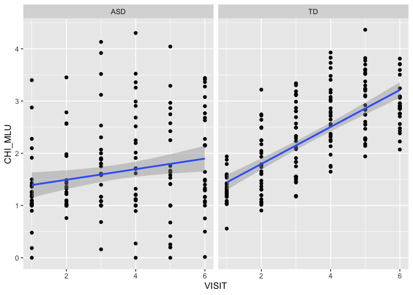
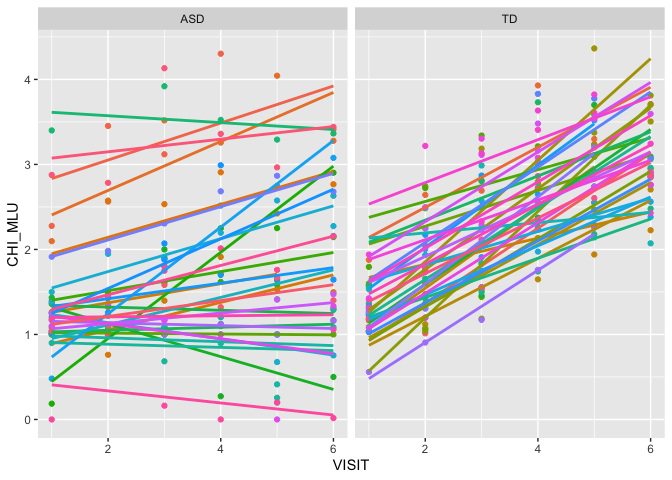
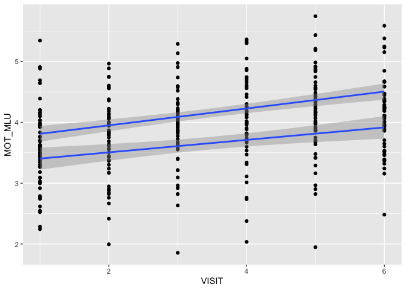
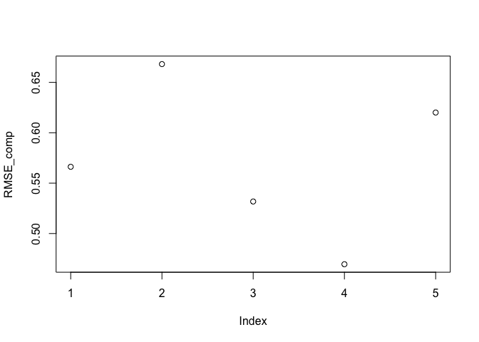
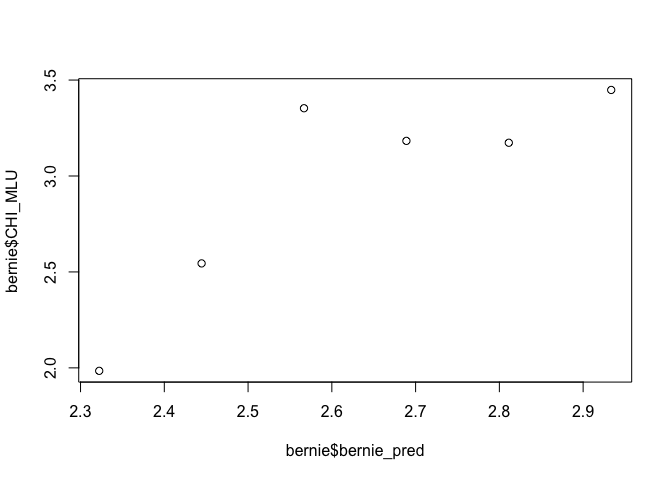

    


# Assignment 2

In this assignment you will have to discuss a few important questions (given the data you have). More details below. The assignment submitted to the teachers consists of:
- a report answering and discussing the questions (so we can assess your conceptual understanding and ability to explain and critically reflect)
- a link to a git repository with all the code (so we can assess your code)

Part 1 - Basic description of language development
- Describe your sample (n, age, gender, clinical and cognitive features of the two groups) and critically assess whether the groups (ASD and TD) are balanced
- Describe linguistic development (in terms of MLU over time) in TD and ASD children (as a function of group). 
- Describe how parental use of language (in terms of MLU) changes over time. What do you think is going on?
- Include individual differences in your model of language development (in children). Identify the best model.

Part 2 - Model comparison
- Discuss the differences in performance of your model in training and testing data
- Which individual differences should be included in a model that maximizes your ability to explain/predict new data?
- Predict a new kid's performance (Bernie) and discuss it against expected performance of the two groups

Part 3 - Simulations to plan a new study
- Report and discuss a power analyses identifying how many new kids you would need to replicate the results

The following involves only Part 1.

## Learning objectives

- Summarize and report data and models
- Critically apply mixed effects (or multilevel) models
- Explore the issues involved in feature selection


# Quick recap
Autism Spectrum Disorder is often related to language impairment. However, this phenomenon has not been empirically traced in detail:
i) relying on actual naturalistic language production,  ii) over extended periods of time.

We therefore videotaped circa 30 kids with ASD and circa 30 comparison kids (matched by linguistic performance at visit 1) for ca. 30 minutes of naturalistic interactions with a parent. We repeated the data collection 6 times per kid, with 4 months between each visit. We transcribed the data and counted: 
i) the amount of words that each kid uses in each video. Same for the parent.
ii) the amount of unique words that each kid uses in each video. Same for the parent.
iii) the amount of morphemes per utterance (Mean Length of Utterance) displayed by each child in each video. Same for the parent. 

This data is in the file you prepared in the previous class. 

NB. A few children have been excluded from your datasets. We will be using them next week to evaluate how good your models are in assessing the linguistic development in new participants.

This RMarkdown file includes 
1) questions (see above). Questions have to be answered/discussed in a separate document that you have to directly send to the teachers.
2) A break down of the questions into a guided template full of hints for writing the code to solve the exercises. Fill in the code and the paragraphs as required. Then report your results in the doc for the teachers.

REMEMBER that you will have to have a github repository for the code and send the answers to Kenneth and Riccardo without code (but a link to your github/gitlab repository). This way we can check your code, but you are also forced to figure out how to report your analyses :-)

Before we get going, here is a reminder of the issues you will have to discuss in your report:

1- Describe your sample (n, age, gender, clinical and cognitive features of the two groups) and critically assess whether the groups (ASD and TD) are balanced
2- Describe linguistic development (in terms of MLU over time) in TD and ASD children (as a function of group). 
3- Describe how parental use of language (in terms of MLU) changes over time. What do you think is going on?
4- Include individual differences in your model of language development (in children). Identify the best model.

# Let's go

### Loading the relevant libraries

Load necessary libraries : what will you need?
- e.g. something to deal with the data
- e.g. mixed effects models
- e.g. something to plot with


### Define your working directory and load the data
If you created a project for this class and opened this Rmd file from within that project, your working directory is your project directory.

If you opened this Rmd file outside of a project, you will need some code to find the data:
- Create a new variable called locpath (localpath)
- Set it to be equal to your working directory
- Move to that directory (setwd(locpath))
- Load the data you saved last time (use read_csv(fileName))


### Characterize the participants (Exercise 1)

<!-- Identify relevant variables: participants demographic characteristics, diagnosis, ADOS, Verbal IQ, Non Verbal IQ, Socialization, Visit, Number of words used, Number of unique words used, mean length of utterance in both child and parents. -->

<!-- Make sure the variables are in the right format. -->

<!-- Describe the characteristics of the two groups of participants and whether the two groups are well matched. -->


```r
#demographic characteristics

###AGE, Verbal IQ, Non-verbal IQ, ADOS, Socialization, Unique words, total words, MLU_CHI, MLU_MOT###
#info with diagnosis
df %>%
  subset(VISIT==1) %>%
  subset(Diagnosis=="ASD") %>% 
  describe()
```

```
##            vars  n    mean     sd  median trimmed    mad    min     max
## SUBJ*         1 29   31.97  18.04   32.00   32.00  19.27   2.00   61.00
## VISIT         2 29    1.00   0.00    1.00    1.00   0.00   1.00    1.00
## MOT_MLU       3 29    3.35   0.70    3.30    3.32   0.79   2.24    4.88
## CHI_MLU       4 29    1.30   0.69    1.18    1.25   0.27   0.00    3.40
## types_MOT     5 29  297.14  75.45  295.00  295.48  63.75 152.00  485.00
## types_CHI     6 29   41.97  46.07   16.00   36.76  19.27   0.00  149.00
## tokens_MOT    7 29 1637.90 655.33 1591.00 1623.28 810.98 578.00 2859.00
## tokens_CHI    8 29  161.00 151.00  117.00  148.56 121.57   0.00  483.00
## Diagnosis*    9 29    1.00   0.00    1.00    1.00   0.00   1.00    1.00
## Ethnicity*   10 29    5.69   1.54    6.00    5.88   0.00   1.00    8.00
## Gender*      11 29    1.86   0.35    2.00    1.92   0.00   1.00    2.00
## Age          12 29   33.00   5.59   34.03   33.21   5.10  18.77   42.00
## ADOS1        13 29   14.21   3.89   14.00   14.20   4.45   7.00   21.00
## MR           14 29   26.90   5.68   27.00   26.96   4.45  13.00   42.00
## ExLaRaw      15 29   17.31   7.45   14.00   16.88   7.41   8.00   33.00
## Socializ     16 29   76.90   9.36   76.00   76.52  11.86  64.00  100.00
##              range  skew kurtosis     se
## SUBJ*        59.00 -0.02    -1.16   3.35
## VISIT         0.00   NaN      NaN   0.00
## MOT_MLU       2.64  0.34    -0.77   0.13
## CHI_MLU       3.40  1.07     1.80   0.13
## types_MOT   333.00  0.24    -0.37  14.01
## types_CHI   149.00  1.03    -0.36   8.56
## tokens_MOT 2281.00  0.13    -1.04 121.69
## tokens_CHI  483.00  0.95    -0.37  28.04
## Diagnosis*    0.00   NaN      NaN   0.00
## Ethnicity*    7.00 -1.88     3.66   0.29
## Gender*       1.00 -1.99     2.04   0.07
## Age          23.23 -0.50    -0.39   1.04
## ADOS1        14.00  0.09    -0.94   0.72
## MR           29.00  0.03     0.72   1.05
## ExLaRaw      25.00  0.52    -1.18   1.38
## Socializ     36.00  0.36    -0.80   1.74
```

```r
#info without diagnosis
df %>%
  subset(VISIT==1) %>%
  subset(Diagnosis=="TD") %>% 
  describe()
```

```
##            vars  n    mean     sd  median trimmed    mad    min     max
## SUBJ*         1 32   30.12  17.73   29.50   30.15  23.72   1.00   59.00
## VISIT         2 32    1.00   0.00    1.00    1.00   0.00   1.00    1.00
## MOT_MLU       3 32    3.73   0.55    3.60    3.68   0.49   2.78    5.34
## CHI_MLU       4 32    1.31   0.28    1.26    1.30   0.23   0.56    1.94
## types_MOT     5 32  305.72  68.07  304.00  304.88  63.01 178.00  467.00
## types_CHI     6 32   44.75  33.12   35.00   41.77  34.10   7.00  120.00
## tokens_MOT    7 32 1680.91 516.34 1594.50 1652.00 389.92 584.00 2740.00
## tokens_CHI    8 32  193.53 121.74  148.50  183.27 123.80  16.00  473.00
## Diagnosis*    9 32    2.00   0.00    2.00    2.00   0.00   2.00    2.00
## Ethnicity*   10 32    5.88   0.71    6.00    6.00   0.00   2.00    6.00
## Gender*      11 32    1.81   0.40    2.00    1.88   0.00   1.00    2.00
## Age          12 32   20.37   1.49   19.95   20.20   1.16  18.30   23.90
## ADOS1        13 32    0.88   1.54    0.00    0.54   0.00   0.00    5.00
## MR           14 32   26.00   3.34   26.50   26.15   3.71  19.00   32.00
## ExLaRaw      15 32   20.22   5.13   19.00   19.69   4.45  13.00   33.00
## Socializ     16 32  100.81   6.68  102.00  101.00   5.93  86.00  115.00
##              range  skew kurtosis    se
## SUBJ*        58.00  0.01    -1.48  3.13
## VISIT         0.00   NaN      NaN  0.00
## MOT_MLU       2.57  0.85     0.96  0.10
## CHI_MLU       1.38  0.14     0.62  0.05
## types_MOT   289.00  0.16    -0.29 12.03
## types_CHI   113.00  0.67    -0.83  5.85
## tokens_MOT 2156.00  0.43    -0.46 91.28
## tokens_CHI  457.00  0.66    -0.63 21.52
## Diagnosis*    0.00   NaN      NaN  0.00
## Ethnicity*    4.00 -5.14    25.18  0.12
## Gender*       1.00 -1.53     0.34  0.07
## Age           5.60  0.97    -0.22  0.26
## ADOS1         5.00  1.59     1.16  0.27
## MR           13.00 -0.30    -0.97  0.59
## ExLaRaw      20.00  0.88    -0.08  0.91
## Socializ     29.00 -0.21    -0.28  1.18
```

```r
##See written out descriptions in paper##

###GENDER###
df %>%
  subset(VISIT==1) %>% 
  summary() #Overall
```

```
##       SUBJ        VISIT      MOT_MLU         CHI_MLU        types_MOT    
##  AD     : 1   Min.   :1   Min.   :2.245   Min.   :0.000   Min.   :152.0  
##  Adam   : 1   1st Qu.:1   1st Qu.:3.093   1st Qu.:1.044   1st Qu.:258.0  
##  AH     : 1   Median :1   Median :3.544   Median :1.250   Median :295.0  
##  Albert : 1   Mean   :1   Mean   :3.548   Mean   :1.307   Mean   :301.6  
##  Alfie  : 1   3rd Qu.:1   3rd Qu.:3.960   3rd Qu.:1.426   3rd Qu.:343.0  
##  Allison: 1   Max.   :1   Max.   :5.344   Max.   :3.400   Max.   :485.0  
##  (Other):55                                                              
##    types_CHI        tokens_MOT     tokens_CHI    Diagnosis
##  Min.   :  0.00   Min.   : 578   Min.   :  0.0   ASD:29   
##  1st Qu.: 11.00   1st Qu.:1262   1st Qu.: 68.0   TD :32   
##  Median : 32.00   Median :1591   Median :137.0            
##  Mean   : 43.43   Mean   :1660   Mean   :178.1            
##  3rd Qu.: 69.00   3rd Qu.:2054   3rd Qu.:254.0            
##  Max.   :149.00   Max.   :2859   Max.   :483.0            
##                                                           
##             Ethnicity  Gender      Age            ADOS1       
##  White           :53   F:10   Min.   :18.30   Min.   : 0.000  
##  African American: 2   M:51   1st Qu.:19.87   1st Qu.: 0.000  
##  White/Latino    : 2          Median :23.13   Median : 5.000  
##  Asian           : 1          Mean   :26.37   Mean   : 7.213  
##  Bangladeshi     : 1          3rd Qu.:34.00   3rd Qu.:14.000  
##  Lebanese        : 1          Max.   :42.00   Max.   :21.000  
##  (Other)         : 1                                          
##        MR           ExLaRaw         Socializ     
##  Min.   :13.00   Min.   : 8.00   Min.   : 64.00  
##  1st Qu.:24.00   1st Qu.:14.00   1st Qu.: 77.00  
##  Median :27.00   Median :18.00   Median : 90.00  
##  Mean   :26.43   Mean   :18.84   Mean   : 89.44  
##  3rd Qu.:29.00   3rd Qu.:22.00   3rd Qu.:102.00  
##  Max.   :42.00   Max.   :33.00   Max.   :115.00  
## 
```

```r
df %>%
  subset(VISIT==1) %>%
  subset(Diagnosis=="TD") %>%
  summary()
```

```
##       SUBJ        VISIT      MOT_MLU         CHI_MLU         types_MOT    
##  AD     : 1   Min.   :1   Min.   :2.776   Min.   :0.5584   Min.   :178.0  
##  AH     : 1   1st Qu.:1   1st Qu.:3.430   1st Qu.:1.1775   1st Qu.:259.5  
##  AR     : 1   Median :1   Median :3.602   Median :1.2617   Median :304.0  
##  AS     : 1   Mean   :1   Mean   :3.726   Mean   :1.3102   Mean   :305.7  
##  AS2    : 1   3rd Qu.:1   3rd Qu.:3.983   3rd Qu.:1.4527   3rd Qu.:343.5  
##  AZ     : 1   Max.   :1   Max.   :5.344   Max.   :1.9397   Max.   :467.0  
##  (Other):26                                                               
##    types_CHI        tokens_MOT     tokens_CHI    Diagnosis
##  Min.   :  7.00   Min.   : 584   Min.   : 16.0   ASD: 0   
##  1st Qu.: 16.50   1st Qu.:1346   1st Qu.:100.5   TD :32   
##  Median : 35.00   Median :1594   Median :148.5            
##  Mean   : 44.75   Mean   :1681   Mean   :193.5            
##  3rd Qu.: 69.50   3rd Qu.:1911   3rd Qu.:260.0            
##  Max.   :120.00   Max.   :2740   Max.   :473.0            
##                                                           
##             Ethnicity  Gender      Age            ADOS1      
##  White           :31   F: 6   Min.   :18.30   Min.   :0.000  
##  Asian           : 1   M:26   1st Qu.:19.26   1st Qu.:0.000  
##  African American: 0          Median :19.95   Median :0.000  
##  Bangladeshi     : 0          Mean   :20.37   Mean   :0.875  
##  Bangledeshi     : 0          3rd Qu.:20.91   3rd Qu.:1.000  
##  Lebanese        : 0          Max.   :23.90   Max.   :5.000  
##  (Other)         : 0                                         
##        MR          ExLaRaw         Socializ    
##  Min.   :19.0   Min.   :13.00   Min.   : 86.0  
##  1st Qu.:24.0   1st Qu.:17.00   1st Qu.: 96.0  
##  Median :26.5   Median :19.00   Median :102.0  
##  Mean   :26.0   Mean   :20.22   Mean   :100.8  
##  3rd Qu.:29.0   3rd Qu.:22.00   3rd Qu.:104.5  
##  Max.   :32.0   Max.   :33.00   Max.   :115.0  
## 
```

```r
df %>%
  subset(VISIT==1) %>%
  subset(Diagnosis=="ASD") %>%
  summary()
```

```
##       SUBJ        VISIT      MOT_MLU         CHI_MLU        types_MOT    
##  Adam   : 1   Min.   :1   Min.   :2.245   Min.   :0.000   Min.   :152.0  
##  Albert : 1   1st Qu.:1   1st Qu.:2.747   1st Qu.:1.018   1st Qu.:252.0  
##  Alfie  : 1   Median :1   Median :3.304   Median :1.181   Median :295.0  
##  Allison: 1   Mean   :1   Mean   :3.352   Mean   :1.304   Mean   :297.1  
##  Annie  : 1   3rd Qu.:1   3rd Qu.:3.766   3rd Qu.:1.395   3rd Qu.:338.0  
##  Charles: 1   Max.   :1   Max.   :4.884   Max.   :3.400   Max.   :485.0  
##  (Other):23                                                              
##    types_CHI        tokens_MOT     tokens_CHI  Diagnosis
##  Min.   :  0.00   Min.   : 578   Min.   :  0   ASD:29   
##  1st Qu.:  9.00   1st Qu.:1019   1st Qu.: 40   TD : 0   
##  Median : 16.00   Median :1591   Median :117            
##  Mean   : 41.97   Mean   :1638   Mean   :161            
##  3rd Qu.: 67.00   3rd Qu.:2084   3rd Qu.:227            
##  Max.   :149.00   Max.   :2859   Max.   :483            
##                                                         
##             Ethnicity  Gender      Age            ADOS1      
##  White           :22   F: 4   Min.   :18.77   Min.   : 7.00  
##  African American: 2   M:25   1st Qu.:28.80   1st Qu.:11.00  
##  White/Latino    : 2          Median :34.03   Median :14.00  
##  Bangladeshi     : 1          Mean   :33.00   Mean   :14.21  
##  Lebanese        : 1          3rd Qu.:36.73   3rd Qu.:17.00  
##  White/Asian     : 1          Max.   :42.00   Max.   :21.00  
##  (Other)         : 0                                         
##        MR          ExLaRaw         Socializ    
##  Min.   :13.0   Min.   : 8.00   Min.   : 64.0  
##  1st Qu.:25.0   1st Qu.:11.00   1st Qu.: 69.0  
##  Median :27.0   Median :14.00   Median : 76.0  
##  Mean   :26.9   Mean   :17.31   Mean   : 76.9  
##  3rd Qu.:30.0   3rd Qu.:24.00   3rd Qu.: 85.0  
##  Max.   :42.0   Max.   :33.00   Max.   :100.0  
## 
```

```r
##Very unequal gender distribution within groups - But the proportion seems to at large be similar in ASD and TD kids. 
```

## Let's test hypothesis 1: Children with ASD display a language impairment  (Exercise 2)

### Hypothesis: The child's MLU changes: i) over time, ii) according to diagnosis


```r
#plotting difference between diagnoses
ggplot(df,
  aes(x = VISIT, y=CHI_MLU, group=Diagnosis))+
  geom_point()+
  geom_smooth(method=lm) +
  facet_wrap(.~Diagnosis)
```

<!-- -->

```r
#plotting per subject
ggplot(df,
  aes(x = VISIT, y = CHI_MLU, colour=SUBJ)) +
  geom_point() +
  geom_smooth(se=FALSE, method = lm) +
  facet_wrap(.~Diagnosis)+
  theme(legend.position = "none")
```

<!-- -->

```r
###MODELING###
model1 <- lmer(
  CHI_MLU~1+Diagnosis*VISIT+
  (1+VISIT|SUBJ),
  data = df,REML=FALSE)

model1
```

```
## Linear mixed model fit by maximum likelihood  ['lmerMod']
## Formula: CHI_MLU ~ 1 + Diagnosis * VISIT + (1 + VISIT | SUBJ)
##    Data: df
##       AIC       BIC    logLik  deviance  df.resid 
##  572.4623  603.3713 -278.2311  556.4623       344 
## Random effects:
##  Groups   Name        Std.Dev. Corr 
##  SUBJ     (Intercept) 0.5424        
##           VISIT       0.1059   -0.16
##  Residual             0.4008        
## Number of obs: 352, groups:  SUBJ, 61
## Fixed Effects:
##       (Intercept)        DiagnosisTD              VISIT  
##            1.3046            -0.2169             0.1005  
## DiagnosisTD:VISIT  
##            0.2533
```

```r
#A simple linear model with the interaction between n-visit and diagnosis (different development per visit per diagnosis) and SUBJECT as random intercept and random slope for each participant per visit. 
```

How would you evaluate whether the model is a good model?


```r
##Constructing a null-model for comparison
model0 <- 
  lmer(CHI_MLU~1*VISIT+(1+VISIT|SUBJ),
       df,
       REML=FALSE)

##Comparing the simple model with the corresponding null-model to see if more variance is explained:
anova(model0,
      model1)
```

```
## Data: df
## Models:
## model0: CHI_MLU ~ 1 * VISIT + (1 + VISIT | SUBJ)
## model1: CHI_MLU ~ 1 + Diagnosis * VISIT + (1 + VISIT | SUBJ)
##        Df    AIC    BIC  logLik deviance  Chisq Chi Df Pr(>Chisq)    
## model0  5 659.27 678.59 -324.64   649.27                             
## model1  8 572.46 603.37 -278.23   556.46 92.811      3  < 2.2e-16 ***
## ---
## Signif. codes:  0 '***' 0.001 '**' 0.01 '*' 0.05 '.' 0.1 ' ' 1
```

```r
##Significantly more variance is explained. Consulting the AIC and BIC also seem to suggest a better model fit when including the main effect of diagnosis.


###BUILDING UP FINAL MODEL FROM THE SIMPLEST TO THE MOST COMPLEX###
#only random intercept
model2 =
  lmer(CHI_MLU ~ VISIT + Diagnosis + (1|SUBJ),
       df,
       REML=FALSE)

anova(model0,
      model2)
```

```
## Data: df
## Models:
## model0: CHI_MLU ~ 1 * VISIT + (1 + VISIT | SUBJ)
## model2: CHI_MLU ~ VISIT + Diagnosis + (1 | SUBJ)
##        Df    AIC    BIC  logLik deviance Chisq Chi Df Pr(>Chisq)
## model0  5 659.27 678.59 -324.64   649.27                        
## model2  5 661.65 680.97 -325.83   651.65     0      0          1
```

```r
model3 = 
  lmer(CHI_MLU ~ VISIT * Diagnosis + (1|SUBJ),
       df,
       REML=FALSE)

anova(model0,
      model3)
```

```
## Data: df
## Models:
## model0: CHI_MLU ~ 1 * VISIT + (1 + VISIT | SUBJ)
## model3: CHI_MLU ~ VISIT * Diagnosis + (1 | SUBJ)
##        Df    AIC    BIC  logLik deviance  Chisq Chi Df Pr(>Chisq)    
## model0  5 659.27 678.59 -324.64   649.27                             
## model3  6 592.71 615.89 -290.36   580.71 68.561      1  < 2.2e-16 ***
## ---
## Signif. codes:  0 '***' 0.001 '**' 0.01 '*' 0.05 '.' 0.1 ' ' 1
```

```r
model4 = 
  lmer(CHI_MLU ~ 1+VISIT + Diagnosis + (0+VISIT|SUBJ),
       df,
       REML=FALSE) #ecach child has unique slope, only

anova(model0,
      model4)
```

```
## Data: df
## Models:
## model0: CHI_MLU ~ 1 * VISIT + (1 + VISIT | SUBJ)
## model4: CHI_MLU ~ 1 + VISIT + Diagnosis + (0 + VISIT | SUBJ)
##        Df    AIC    BIC  logLik deviance  Chisq Chi Df Pr(>Chisq)    
## model0  5 659.27 678.59 -324.64   649.27                             
## model4  5 647.52 666.84 -318.76   637.52 11.752      0  < 2.2e-16 ***
## ---
## Signif. codes:  0 '***' 0.001 '**' 0.01 '*' 0.05 '.' 0.1 ' ' 1
```

```r
anova(model0,
      model1)# comparing our best model with null model - model 1 seemed to provide the best fit. Thus values from that is used: 
```

```
## Data: df
## Models:
## model0: CHI_MLU ~ 1 * VISIT + (1 + VISIT | SUBJ)
## model1: CHI_MLU ~ 1 + Diagnosis * VISIT + (1 + VISIT | SUBJ)
##        Df    AIC    BIC  logLik deviance  Chisq Chi Df Pr(>Chisq)    
## model0  5 659.27 678.59 -324.64   649.27                             
## model1  8 572.46 603.37 -278.23   556.46 92.811      3  < 2.2e-16 ***
## ---
## Signif. codes:  0 '***' 0.001 '**' 0.01 '*' 0.05 '.' 0.1 ' ' 1
```

```r
summary(model1)
```

```
## Linear mixed model fit by maximum likelihood  ['lmerMod']
## Formula: CHI_MLU ~ 1 + Diagnosis * VISIT + (1 + VISIT | SUBJ)
##    Data: df
## 
##      AIC      BIC   logLik deviance df.resid 
##    572.5    603.4   -278.2    556.5      344 
## 
## Scaled residuals: 
##      Min       1Q   Median       3Q      Max 
## -2.48471 -0.53247 -0.08812  0.44178  2.73713 
## 
## Random effects:
##  Groups   Name        Variance Std.Dev. Corr 
##  SUBJ     (Intercept) 0.29423  0.5424        
##           VISIT       0.01122  0.1059   -0.16
##  Residual             0.16063  0.4008        
## Number of obs: 352, groups:  SUBJ, 61
## 
## Fixed effects:
##                   Estimate Std. Error t value
## (Intercept)        1.30459    0.12273  10.629
## DiagnosisTD       -0.21693    0.16953  -1.280
## VISIT              0.10046    0.02680   3.749
## DiagnosisTD:VISIT  0.25331    0.03712   6.823
## 
## Correlation of Fixed Effects:
##             (Intr) DgnsTD VISIT 
## DiagnosisTD -0.724              
## VISIT       -0.443  0.321       
## DgnTD:VISIT  0.320 -0.445 -0.722
```

<!-- As per the graphical representations above, there seems to be steeper and more consistent development over time for the children that do not have the ASD diagnosis.  -->

## Let's test hypothesis 2: Parents speak equally to children with ASD and TD  (Exercise 3)


```r
#First testing for time as main effect against null model: (Assuming that the interaction from the CHI_MLU upholds here as well)

model2_0 = 
  lmer(MOT_MLU ~ 1+Diagnosis + (1+VISIT|SUBJ),
       df,
       REML=FALSE)
```

```
## Warning in checkConv(attr(opt, "derivs"), opt$par, ctrl =
## control$checkConv, : Model failed to converge with max|grad| = 0.00779769
## (tol = 0.002, component 1)
```

```r
model2_1 = 
  lmer(MOT_MLU ~ 1+VISIT+Diagnosis + (1+VISIT|SUBJ),
       df, 
       REML=FALSE)

summary(model2_1)
```

```
## Linear mixed model fit by maximum likelihood  ['lmerMod']
## Formula: MOT_MLU ~ 1 + VISIT + Diagnosis + (1 + VISIT | SUBJ)
##    Data: df
## 
##      AIC      BIC   logLik deviance df.resid 
##    512.7    539.8   -249.4    498.7      345 
## 
## Scaled residuals: 
##      Min       1Q   Median       3Q      Max 
## -2.89514 -0.59460 -0.02913  0.53790  3.00481 
## 
## Random effects:
##  Groups   Name        Variance Std.Dev. Corr 
##  SUBJ     (Intercept) 0.32937  0.5739        
##           VISIT       0.01134  0.1065   -0.70
##  Residual             0.14723  0.3837        
## Number of obs: 352, groups:  SUBJ, 61
## 
## Fixed effects:
##             Estimate Std. Error t value
## (Intercept)  3.23811    0.10540  30.721
## VISIT        0.12024    0.01823   6.595
## DiagnosisTD  0.50192    0.11334   4.429
## 
## Correlation of Fixed Effects:
##             (Intr) VISIT 
## VISIT       -0.627       
## DiagnosisTD -0.566  0.003
```

```r
anova(model2_0,
      model2_1) #Significant
```

```
## Data: df
## Models:
## model2_0: MOT_MLU ~ 1 + Diagnosis + (1 + VISIT | SUBJ)
## model2_1: MOT_MLU ~ 1 + VISIT + Diagnosis + (1 + VISIT | SUBJ)
##          Df    AIC    BIC  logLik deviance  Chisq Chi Df Pr(>Chisq)    
## model2_0  6 543.96 567.14 -265.98   531.96                             
## model2_1  7 512.71 539.75 -249.35   498.71 33.252      1  8.094e-09 ***
## ---
## Signif. codes:  0 '***' 0.001 '**' 0.01 '*' 0.05 '.' 0.1 ' ' 1
```

```r
model2_0_2 = 
  lmer(MOT_MLU ~ 1*VISIT+ (1+VISIT|SUBJ),
       df,
       REML=FALSE)
```

```
## Warning in checkConv(attr(opt, "derivs"), opt$par, ctrl =
## control$checkConv, : Model failed to converge with max|grad| = 0.00536907
## (tol = 0.002, component 1)
```

```r
model2_2 = 
  lmer(MOT_MLU ~ 1+VISIT * Diagnosis + (1+VISIT|SUBJ),
       df,
       REML=FALSE)
```

```
## Warning in checkConv(attr(opt, "derivs"), opt$par, ctrl =
## control$checkConv, : Model failed to converge with max|grad| = 0.033954
## (tol = 0.002, component 1)
```

```r
anova(model2_0_2,
      model2_2)
```

```
## Data: df
## Models:
## model2_0_2: MOT_MLU ~ 1 * VISIT + (1 + VISIT | SUBJ)
## model2_2: MOT_MLU ~ 1 + VISIT * Diagnosis + (1 + VISIT | SUBJ)
##            Df    AIC    BIC  logLik deviance  Chisq Chi Df Pr(>Chisq)    
## model2_0_2  5 558.66 577.98 -274.33   548.66                             
## model2_2    8 513.48 544.39 -248.74   497.48 51.176      3  4.486e-11 ***
## ---
## Signif. codes:  0 '***' 0.001 '**' 0.01 '*' 0.05 '.' 0.1 ' ' 1
```

```r
anova(model2_2,
      model2_1) ##Model 2_1 seems to explain the most. 
```

```
## Data: df
## Models:
## model2_1: MOT_MLU ~ 1 + VISIT + Diagnosis + (1 + VISIT | SUBJ)
## model2_2: MOT_MLU ~ 1 + VISIT * Diagnosis + (1 + VISIT | SUBJ)
##          Df    AIC    BIC  logLik deviance  Chisq Chi Df Pr(>Chisq)
## model2_1  7 512.71 539.75 -249.35   498.71                         
## model2_2  8 513.48 544.39 -248.74   497.48 1.2267      1     0.2681
```

```r
summary(model2_2)
```

```
## Linear mixed model fit by maximum likelihood  ['lmerMod']
## Formula: MOT_MLU ~ 1 + VISIT * Diagnosis + (1 + VISIT | SUBJ)
##    Data: df
## 
##      AIC      BIC   logLik deviance df.resid 
##    513.5    544.4   -248.7    497.5      344 
## 
## Scaled residuals: 
##      Min       1Q   Median       3Q      Max 
## -2.88772 -0.58849 -0.03626  0.53919  2.96325 
## 
## Random effects:
##  Groups   Name        Variance Std.Dev. Corr 
##  SUBJ     (Intercept) 0.32523  0.5703        
##           VISIT       0.01103  0.1050   -0.69
##  Residual             0.14702  0.3834        
## Number of obs: 352, groups:  SUBJ, 61
## 
## Fixed effects:
##                   Estimate Std. Error t value
## (Intercept)        3.31421    0.12536  26.437
## VISIT              0.09922    0.02614   3.797
## DiagnosisTD        0.35645    0.17314   2.059
## VISIT:DiagnosisTD  0.04023    0.03620   1.111
## 
## Correlation of Fixed Effects:
##             (Intr) VISIT  DgnsTD
## VISIT       -0.755              
## DiagnosisTD -0.724  0.547       
## VISIT:DgnTD  0.545 -0.722 -0.756
## convergence code: 0
## Model failed to converge with max|grad| = 0.033954 (tol = 0.002, component 1)
```

```r
ggplot(data = df,
       aes(x = VISIT, y = MOT_MLU, group=Diagnosis)) + 
  geom_point() +
  geom_smooth(method = lm)
```

<!-- -->

### Adding new variables (Exercise 4)


```r
#### Duplicate the verbal IQ for each participant from 1st visit ### 
ExLaRaw_1st <- 
  vector("numeric") 
for (i in df$SUBJ){
  first = df %>% 
    subset(SUBJ==i)
  values=first$ExLaRaw[1]
  ExLaRaw_1st <- 
    rbind(ExLaRaw_1st,
          values)}
### Appending data to dataframe
df <- 
  mutate(df,
         ExLaRaw_1st)

#### Duplicate the non-verbal IQ for each participant from 1st visit ### 
MR_1st <- 
  vector("numeric") 
for (i in df$SUBJ){
  first = df %>% 
    subset(SUBJ==i)
  print(first$MR[1])
  values=first$MR[1]
  MR_1st <- 
    rbind(MR_1st, 
          values)}
```

```
## [1] 28
## [1] 28
## [1] 28
## [1] 28
## [1] 28
## [1] 28
## [1] 34
## [1] 34
## [1] 34
## [1] 34
## [1] 34
## [1] 29
## [1] 29
## [1] 29
## [1] 29
## [1] 29
## [1] 29
## [1] 31
## [1] 31
## [1] 31
## [1] 31
## [1] 31
## [1] 31
## [1] 34
## [1] 34
## [1] 34
## [1] 34
## [1] 34
## [1] 34
## [1] 20
## [1] 20
## [1] 20
## [1] 20
## [1] 20
## [1] 20
## [1] 24
## [1] 24
## [1] 24
## [1] 24
## [1] 24
## [1] 32
## [1] 32
## [1] 32
## [1] 32
## [1] 32
## [1] 24
## [1] 24
## [1] 24
## [1] 24
## [1] 24
## [1] 27
## [1] 27
## [1] 27
## [1] 27
## [1] 27
## [1] 27
## [1] 21
## [1] 21
## [1] 21
## [1] 21
## [1] 21
## [1] 21
## [1] 30
## [1] 30
## [1] 30
## [1] 30
## [1] 30
## [1] 30
## [1] 25
## [1] 25
## [1] 25
## [1] 25
## [1] 25
## [1] 25
## [1] 23
## [1] 23
## [1] 23
## [1] 23
## [1] 23
## [1] 23
## [1] 24
## [1] 24
## [1] 24
## [1] 24
## [1] 24
## [1] 24
## [1] 29
## [1] 29
## [1] 29
## [1] 29
## [1] 29
## [1] 29
## [1] 25
## [1] 25
## [1] 25
## [1] 25
## [1] 25
## [1] 29
## [1] 29
## [1] 29
## [1] 29
## [1] 29
## [1] 29
## [1] 28
## [1] 28
## [1] 28
## [1] 28
## [1] 28
## [1] 28
## [1] 26
## [1] 26
## [1] 26
## [1] 26
## [1] 26
## [1] 26
## [1] 22
## [1] 22
## [1] 22
## [1] 22
## [1] 22
## [1] 22
## [1] 21
## [1] 21
## [1] 21
## [1] 21
## [1] 21
## [1] 21
## [1] 25
## [1] 25
## [1] 25
## [1] 25
## [1] 25
## [1] 25
## [1] 13
## [1] 13
## [1] 13
## [1] 13
## [1] 13
## [1] 13
## [1] 29
## [1] 29
## [1] 29
## [1] 29
## [1] 29
## [1] 29
## [1] 32
## [1] 32
## [1] 32
## [1] 32
## [1] 32
## [1] 26
## [1] 26
## [1] 26
## [1] 26
## [1] 26
## [1] 26
## [1] 20
## [1] 20
## [1] 20
## [1] 20
## [1] 20
## [1] 20
## [1] 26
## [1] 26
## [1] 26
## [1] 26
## [1] 26
## [1] 26
## [1] 31
## [1] 31
## [1] 31
## [1] 31
## [1] 31
## [1] 31
## [1] 27
## [1] 27
## [1] 27
## [1] 27
## [1] 27
## [1] 27
## [1] 21
## [1] 21
## [1] 21
## [1] 21
## [1] 21
## [1] 21
## [1] 25
## [1] 25
## [1] 25
## [1] 25
## [1] 25
## [1] 25
## [1] 27
## [1] 27
## [1] 27
## [1] 27
## [1] 27
## [1] 27
## [1] 23
## [1] 23
## [1] 23
## [1] 23
## [1] 23
## [1] 23
## [1] 19
## [1] 19
## [1] 19
## [1] 19
## [1] 19
## [1] 19
## [1] 33
## [1] 33
## [1] 33
## [1] 33
## [1] 33
## [1] 33
## [1] 29
## [1] 29
## [1] 29
## [1] 29
## [1] 29
## [1] 26
## [1] 26
## [1] 26
## [1] 26
## [1] 26
## [1] 26
## [1] 27
## [1] 27
## [1] 27
## [1] 27
## [1] 27
## [1] 25
## [1] 25
## [1] 25
## [1] 25
## [1] 25
## [1] 25
## [1] 24
## [1] 24
## [1] 24
## [1] 24
## [1] 24
## [1] 24
## [1] 42
## [1] 42
## [1] 42
## [1] 42
## [1] 42
## [1] 42
## [1] 30
## [1] 30
## [1] 30
## [1] 30
## [1] 30
## [1] 24
## [1] 24
## [1] 24
## [1] 24
## [1] 24
## [1] 21
## [1] 21
## [1] 21
## [1] 21
## [1] 21
## [1] 21
## [1] 27
## [1] 27
## [1] 27
## [1] 27
## [1] 27
## [1] 27
## [1] 28
## [1] 28
## [1] 28
## [1] 28
## [1] 28
## [1] 27
## [1] 27
## [1] 27
## [1] 27
## [1] 27
## [1] 27
## [1] 17
## [1] 17
## [1] 17
## [1] 17
## [1] 17
## [1] 17
## [1] 22
## [1] 22
## [1] 22
## [1] 22
## [1] 22
## [1] 22
## [1] 29
## [1] 29
## [1] 29
## [1] 29
## [1] 29
## [1] 29
## [1] 30
## [1] 30
## [1] 30
## [1] 30
## [1] 30
## [1] 30
## [1] 24
## [1] 24
## [1] 24
## [1] 24
## [1] 24
## [1] 24
## [1] 26
## [1] 26
## [1] 26
## [1] 26
## [1] 26
## [1] 27
## [1] 27
## [1] 27
## [1] 27
## [1] 28
## [1] 28
## [1] 28
## [1] 28
## [1] 28
## [1] 28
## [1] 30
## [1] 30
## [1] 30
## [1] 30
## [1] 30
## [1] 30
## [1] 29
## [1] 29
## [1] 29
## [1] 29
## [1] 29
## [1] 29
## [1] 30
## [1] 30
## [1] 30
## [1] 30
## [1] 30
## [1] 30
## [1] 27
## [1] 27
## [1] 27
## [1] 27
## [1] 27
## [1] 27
```

```r
### Appending data to dataframe
df <- 
  mutate(df, MR_1st)

#### Duplicate ADOS for each participant from 1st visit ### 
ADOS_1st <- 
  vector("numeric") 
for (i in df$SUBJ){
  first = df %>% 
    subset(SUBJ==i)
  print(first$ADOS1[1])
  values=first$ADOS1[1]
  ADOS_1st <- 
    rbind(ADOS_1st,
          values)}
```

```
## [1] 0
## [1] 0
## [1] 0
## [1] 0
## [1] 0
## [1] 0
## [1] 13
## [1] 13
## [1] 13
## [1] 13
## [1] 13
## [1] 1
## [1] 1
## [1] 1
## [1] 1
## [1] 1
## [1] 1
## [1] 8
## [1] 8
## [1] 8
## [1] 8
## [1] 8
## [1] 8
## [1] 9
## [1] 9
## [1] 9
## [1] 9
## [1] 9
## [1] 9
## [1] 17
## [1] 17
## [1] 17
## [1] 17
## [1] 17
## [1] 17
## [1] 18
## [1] 18
## [1] 18
## [1] 18
## [1] 18
## [1] 5
## [1] 5
## [1] 5
## [1] 5
## [1] 5
## [1] 0
## [1] 0
## [1] 0
## [1] 0
## [1] 0
## [1] 3
## [1] 3
## [1] 3
## [1] 3
## [1] 3
## [1] 3
## [1] 0
## [1] 0
## [1] 0
## [1] 0
## [1] 0
## [1] 0
## [1] 0
## [1] 0
## [1] 0
## [1] 0
## [1] 0
## [1] 0
## [1] 0
## [1] 0
## [1] 0
## [1] 0
## [1] 0
## [1] 0
## [1] 0
## [1] 0
## [1] 0
## [1] 0
## [1] 0
## [1] 0
## [1] 0
## [1] 0
## [1] 0
## [1] 0
## [1] 0
## [1] 0
## [1] 0
## [1] 0
## [1] 0
## [1] 0
## [1] 0
## [1] 0
## [1] 14
## [1] 14
## [1] 14
## [1] 14
## [1] 14
## [1] 0
## [1] 0
## [1] 0
## [1] 0
## [1] 0
## [1] 0
## [1] 11
## [1] 11
## [1] 11
## [1] 11
## [1] 11
## [1] 11
## [1] 9
## [1] 9
## [1] 9
## [1] 9
## [1] 9
## [1] 9
## [1] 21
## [1] 21
## [1] 21
## [1] 21
## [1] 21
## [1] 21
## [1] 0
## [1] 0
## [1] 0
## [1] 0
## [1] 0
## [1] 0
## [1] 14
## [1] 14
## [1] 14
## [1] 14
## [1] 14
## [1] 14
## [1] 20
## [1] 20
## [1] 20
## [1] 20
## [1] 20
## [1] 20
## [1] 0
## [1] 0
## [1] 0
## [1] 0
## [1] 0
## [1] 0
## [1] 11
## [1] 11
## [1] 11
## [1] 11
## [1] 11
## [1] 0
## [1] 0
## [1] 0
## [1] 0
## [1] 0
## [1] 0
## [1] 0
## [1] 0
## [1] 0
## [1] 0
## [1] 0
## [1] 0
## [1] 17
## [1] 17
## [1] 17
## [1] 17
## [1] 17
## [1] 17
## [1] 12
## [1] 12
## [1] 12
## [1] 12
## [1] 12
## [1] 12
## [1] 0
## [1] 0
## [1] 0
## [1] 0
## [1] 0
## [1] 0
## [1] 21
## [1] 21
## [1] 21
## [1] 21
## [1] 21
## [1] 21
## [1] 14
## [1] 14
## [1] 14
## [1] 14
## [1] 14
## [1] 14
## [1] 10
## [1] 10
## [1] 10
## [1] 10
## [1] 10
## [1] 10
## [1] 1
## [1] 1
## [1] 1
## [1] 1
## [1] 1
## [1] 1
## [1] 3
## [1] 3
## [1] 3
## [1] 3
## [1] 3
## [1] 3
## [1] 7
## [1] 7
## [1] 7
## [1] 7
## [1] 7
## [1] 7
## [1] 1
## [1] 1
## [1] 1
## [1] 1
## [1] 1
## [1] 11
## [1] 11
## [1] 11
## [1] 11
## [1] 11
## [1] 11
## [1] 13
## [1] 13
## [1] 13
## [1] 13
## [1] 13
## [1] 0
## [1] 0
## [1] 0
## [1] 0
## [1] 0
## [1] 0
## [1] 0
## [1] 0
## [1] 0
## [1] 0
## [1] 0
## [1] 0
## [1] 14
## [1] 14
## [1] 14
## [1] 14
## [1] 14
## [1] 14
## [1] 3
## [1] 3
## [1] 3
## [1] 3
## [1] 3
## [1] 5
## [1] 5
## [1] 5
## [1] 5
## [1] 5
## [1] 20
## [1] 20
## [1] 20
## [1] 20
## [1] 20
## [1] 20
## [1] 0
## [1] 0
## [1] 0
## [1] 0
## [1] 0
## [1] 0
## [1] 17
## [1] 17
## [1] 17
## [1] 17
## [1] 17
## [1] 0
## [1] 0
## [1] 0
## [1] 0
## [1] 0
## [1] 0
## [1] 19
## [1] 19
## [1] 19
## [1] 19
## [1] 19
## [1] 19
## [1] 1
## [1] 1
## [1] 1
## [1] 1
## [1] 1
## [1] 1
## [1] 0
## [1] 0
## [1] 0
## [1] 0
## [1] 0
## [1] 0
## [1] 0
## [1] 0
## [1] 0
## [1] 0
## [1] 0
## [1] 0
## [1] 1
## [1] 1
## [1] 1
## [1] 1
## [1] 1
## [1] 1
## [1] 0
## [1] 0
## [1] 0
## [1] 0
## [1] 0
## [1] 14
## [1] 14
## [1] 14
## [1] 14
## [1] 15
## [1] 15
## [1] 15
## [1] 15
## [1] 15
## [1] 15
## [1] 15
## [1] 15
## [1] 15
## [1] 15
## [1] 15
## [1] 15
## [1] 4
## [1] 4
## [1] 4
## [1] 4
## [1] 4
## [1] 4
## [1] 13
## [1] 13
## [1] 13
## [1] 13
## [1] 13
## [1] 13
## [1] 15
## [1] 15
## [1] 15
## [1] 15
## [1] 15
## [1] 15
```

```r
### Appending data to dataframe
df <- 
  mutate(df, 
         ADOS_1st)

#### Duplicate Socialization for each participant from 1st visit ### 
Socializ_1st <- 
  vector("numeric") 
for (i in df$SUBJ){
  first = df %>% 
    subset(SUBJ==i)
  print(first$Socializ[1])
  values=first$Socializ[1]
  Socializ_1st <- 
    rbind(Socializ_1st, 
          values)}
```

```
## [1] 108
## [1] 108
## [1] 108
## [1] 108
## [1] 108
## [1] 108
## [1] 85
## [1] 85
## [1] 85
## [1] 85
## [1] 85
## [1] 88
## [1] 88
## [1] 88
## [1] 88
## [1] 88
## [1] 88
## [1] 82
## [1] 82
## [1] 82
## [1] 82
## [1] 82
## [1] 82
## [1] 82
## [1] 82
## [1] 82
## [1] 82
## [1] 82
## [1] 82
## [1] 68
## [1] 68
## [1] 68
## [1] 68
## [1] 68
## [1] 68
## [1] 65
## [1] 65
## [1] 65
## [1] 65
## [1] 65
## [1] 102
## [1] 102
## [1] 102
## [1] 102
## [1] 102
## [1] 100
## [1] 100
## [1] 100
## [1] 100
## [1] 100
## [1] 104
## [1] 104
## [1] 104
## [1] 104
## [1] 104
## [1] 104
## [1] 106
## [1] 106
## [1] 106
## [1] 106
## [1] 106
## [1] 106
## [1] 104
## [1] 104
## [1] 104
## [1] 104
## [1] 104
## [1] 104
## [1] 102
## [1] 102
## [1] 102
## [1] 102
## [1] 102
## [1] 102
## [1] 92
## [1] 92
## [1] 92
## [1] 92
## [1] 92
## [1] 92
## [1] 86
## [1] 86
## [1] 86
## [1] 86
## [1] 86
## [1] 86
## [1] 102
## [1] 102
## [1] 102
## [1] 102
## [1] 102
## [1] 102
## [1] 74
## [1] 74
## [1] 74
## [1] 74
## [1] 74
## [1] 106
## [1] 106
## [1] 106
## [1] 106
## [1] 106
## [1] 106
## [1] 88
## [1] 88
## [1] 88
## [1] 88
## [1] 88
## [1] 88
## [1] 86
## [1] 86
## [1] 86
## [1] 86
## [1] 86
## [1] 86
## [1] 72
## [1] 72
## [1] 72
## [1] 72
## [1] 72
## [1] 72
## [1] 106
## [1] 106
## [1] 106
## [1] 106
## [1] 106
## [1] 106
## [1] 65
## [1] 65
## [1] 65
## [1] 65
## [1] 65
## [1] 65
## [1] 67
## [1] 67
## [1] 67
## [1] 67
## [1] 67
## [1] 67
## [1] 90
## [1] 90
## [1] 90
## [1] 90
## [1] 90
## [1] 90
## [1] 100
## [1] 100
## [1] 100
## [1] 100
## [1] 100
## [1] 96
## [1] 96
## [1] 96
## [1] 96
## [1] 96
## [1] 96
## [1] 102
## [1] 102
## [1] 102
## [1] 102
## [1] 102
## [1] 102
## [1] 72
## [1] 72
## [1] 72
## [1] 72
## [1] 72
## [1] 72
## [1] 70
## [1] 70
## [1] 70
## [1] 70
## [1] 70
## [1] 70
## [1] 100
## [1] 100
## [1] 100
## [1] 100
## [1] 100
## [1] 100
## [1] 69
## [1] 69
## [1] 69
## [1] 69
## [1] 69
## [1] 69
## [1] 76
## [1] 76
## [1] 76
## [1] 76
## [1] 76
## [1] 76
## [1] 82
## [1] 82
## [1] 82
## [1] 82
## [1] 82
## [1] 82
## [1] 102
## [1] 102
## [1] 102
## [1] 102
## [1] 102
## [1] 102
## [1] 98
## [1] 98
## [1] 98
## [1] 98
## [1] 98
## [1] 98
## [1] 70
## [1] 70
## [1] 70
## [1] 70
## [1] 70
## [1] 70
## [1] 104
## [1] 104
## [1] 104
## [1] 104
## [1] 104
## [1] 88
## [1] 88
## [1] 88
## [1] 88
## [1] 88
## [1] 88
## [1] 86
## [1] 86
## [1] 86
## [1] 86
## [1] 86
## [1] 102
## [1] 102
## [1] 102
## [1] 102
## [1] 102
## [1] 102
## [1] 96
## [1] 96
## [1] 96
## [1] 96
## [1] 96
## [1] 96
## [1] 65
## [1] 65
## [1] 65
## [1] 65
## [1] 65
## [1] 65
## [1] 94
## [1] 94
## [1] 94
## [1] 94
## [1] 94
## [1] 113
## [1] 113
## [1] 113
## [1] 113
## [1] 113
## [1] 75
## [1] 75
## [1] 75
## [1] 75
## [1] 75
## [1] 75
## [1] 102
## [1] 102
## [1] 102
## [1] 102
## [1] 102
## [1] 102
## [1] 82
## [1] 82
## [1] 82
## [1] 82
## [1] 82
## [1] 108
## [1] 108
## [1] 108
## [1] 108
## [1] 108
## [1] 108
## [1] 64
## [1] 64
## [1] 64
## [1] 64
## [1] 64
## [1] 64
## [1] 102
## [1] 102
## [1] 102
## [1] 102
## [1] 102
## [1] 102
## [1] 94
## [1] 94
## [1] 94
## [1] 94
## [1] 94
## [1] 94
## [1] 98
## [1] 98
## [1] 98
## [1] 98
## [1] 98
## [1] 98
## [1] 115
## [1] 115
## [1] 115
## [1] 115
## [1] 115
## [1] 115
## [1] 96
## [1] 96
## [1] 96
## [1] 96
## [1] 96
## [1] 77
## [1] 77
## [1] 77
## [1] 77
## [1] 66
## [1] 66
## [1] 66
## [1] 66
## [1] 66
## [1] 66
## [1] 88
## [1] 88
## [1] 88
## [1] 88
## [1] 88
## [1] 88
## [1] 108
## [1] 108
## [1] 108
## [1] 108
## [1] 108
## [1] 108
## [1] 87
## [1] 87
## [1] 87
## [1] 87
## [1] 87
## [1] 87
## [1] 79
## [1] 79
## [1] 79
## [1] 79
## [1] 79
## [1] 79
```

```r
### Appending data to dataframe
df <- 
  mutate(df, 
         Socializ_1st)

## Constructing the best fitting model:
model_class <- 
  lmer(CHI_MLU ~ 1+VISIT*Diagnosis + ExLaRaw_1st*MR_1st+(1 + VISIT|SUBJ),
       df, 
       REML=FALSE)

model_class_0 <- 
  lmer(CHI_MLU ~ 1+1*Diagnosis + ExLaRaw_1st*MR_1st+(1 + VISIT|SUBJ),
       df, 
       REML=FALSE)

summary(model_class)
```

```
## Linear mixed model fit by maximum likelihood  ['lmerMod']
## Formula: CHI_MLU ~ 1 + VISIT * Diagnosis + ExLaRaw_1st * MR_1st + (1 +  
##     VISIT | SUBJ)
##    Data: df
## 
##      AIC      BIC   logLik deviance df.resid 
##    517.5    560.0   -247.7    495.5      341 
## 
## Scaled residuals: 
##      Min       1Q   Median       3Q      Max 
## -2.62026 -0.59627 -0.05098  0.43854  2.91952 
## 
## Random effects:
##  Groups   Name        Variance Std.Dev. Corr 
##  SUBJ     (Intercept) 0.09984  0.3160        
##           VISIT       0.01127  0.1062   -0.46
##  Residual             0.16062  0.4008        
## Number of obs: 352, groups:  SUBJ, 61
## 
## Fixed effects:
##                     Estimate Std. Error t value
## (Intercept)         1.048305   0.873090   1.201
## VISIT               0.099945   0.026826   3.726
## DiagnosisTD        -0.365232   0.140675  -2.596
## ExLaRaw_1st         0.006257   0.052340   0.120
## MR_1st             -0.037608   0.032985  -1.140
## VISIT:DiagnosisTD   0.253647   0.037165   6.825
## ExLaRaw_1st:MR_1st  0.002347   0.001772   1.324
## 
## Correlation of Fixed Effects:
##             (Intr) VISIT  DgnsTD ExLR_1 MR_1st VISIT:
## VISIT       -0.073                                   
## DiagnosisTD  0.212  0.445                            
## ExLaRaw_1st -0.907  0.001 -0.388                     
## MR_1st      -0.975  0.003 -0.218  0.840              
## VISIT:DgnTD  0.053 -0.722 -0.616  0.000 -0.002       
## ExLR_1:MR_1  0.940 -0.002  0.343 -0.982 -0.910  0.001
```

```r
anova(model_class_0,
      model_class)
```

```
## Data: df
## Models:
## model_class_0: CHI_MLU ~ 1 + 1 * Diagnosis + ExLaRaw_1st * MR_1st + (1 + VISIT | 
## model_class_0:     SUBJ)
## model_class: CHI_MLU ~ 1 + VISIT * Diagnosis + ExLaRaw_1st * MR_1st + (1 + 
## model_class:     VISIT | SUBJ)
##               Df    AIC    BIC  logLik deviance Chisq Chi Df Pr(>Chisq)
## model_class_0  8 604.64 635.55 -294.32   588.64                        
## model_class   11 517.49 559.99 -247.75   495.49 93.15      3  < 2.2e-16
##                  
## model_class_0    
## model_class   ***
## ---
## Signif. codes:  0 '***' 0.001 '**' 0.01 '*' 0.05 '.' 0.1 ' ' 1
```

```r
model_class1 <- 
  lmer(CHI_MLU ~ 1+VISIT*Diagnosis + VISIT*MR_1st+(1 + VISIT|SUBJ),
       df, 
       REML=FALSE)

summary(model_class1) #Interaction between VISIT:MR_1st not significant. Trying ExLaRaw instead:
```

```
## Linear mixed model fit by maximum likelihood  ['lmerMod']
## Formula: CHI_MLU ~ 1 + VISIT * Diagnosis + VISIT * MR_1st + (1 + VISIT |  
##     SUBJ)
##    Data: df
## 
##      AIC      BIC   logLik deviance df.resid 
##    554.2    592.8   -267.1    534.2      342 
## 
## Scaled residuals: 
##     Min      1Q  Median      3Q     Max 
## -2.3582 -0.5501 -0.0705  0.4609  2.7723 
## 
## Random effects:
##  Groups   Name        Variance Std.Dev. Corr 
##  SUBJ     (Intercept) 0.22360  0.4729        
##           VISIT       0.01069  0.1034   -0.31
##  Residual             0.16062  0.4008        
## Number of obs: 352, groups:  SUBJ, 61
## 
## Fixed effects:
##                    Estimate Std. Error t value
## (Intercept)       -0.270703   0.473219  -0.572
## VISIT             -0.039179   0.111183  -0.352
## DiagnosisTD       -0.164596   0.155974  -1.055
## MR_1st             0.058574   0.017102   3.425
## VISIT:DiagnosisTD  0.258166   0.036831   7.010
## VISIT:MR_1st       0.005191   0.004016   1.293
## 
## Correlation of Fixed Effects:
##             (Intr) VISIT  DgnsTD MR_1st VISIT:D
## VISIT       -0.562                             
## DiagnosisTD -0.266  0.151                      
## MR_1st      -0.971  0.546  0.098               
## VISIT:DgnTD  0.150 -0.268 -0.564 -0.056        
## VISIT:MR_1s  0.546 -0.971 -0.056 -0.562  0.100
```

```r
model_class2 <- 
  lmer(CHI_MLU ~ 1+VISIT*Diagnosis + VISIT*ExLaRaw_1st+(1 + VISIT|SUBJ),
       df, 
       REML=FALSE)

summary(model_class2)
```

```
## Linear mixed model fit by maximum likelihood  ['lmerMod']
## Formula: CHI_MLU ~ 1 + VISIT * Diagnosis + VISIT * ExLaRaw_1st + (1 +  
##     VISIT | SUBJ)
##    Data: df
## 
##      AIC      BIC   logLik deviance df.resid 
##    516.6    555.3   -248.3    496.6      342 
## 
## Scaled residuals: 
##      Min       1Q   Median       3Q      Max 
## -2.50223 -0.57004 -0.04358  0.45961  2.94946 
## 
## Random effects:
##  Groups   Name        Variance Std.Dev. Corr 
##  SUBJ     (Intercept) 0.10567  0.3251        
##           VISIT       0.01106  0.1052   -0.46
##  Residual             0.16062  0.4008        
## Number of obs: 352, groups:  SUBJ, 61
## 
## Fixed effects:
##                    Estimate Std. Error t value
## (Intercept)        0.092879   0.200305   0.464
## VISIT              0.060436   0.057702   1.047
## DiagnosisTD       -0.418954   0.131361  -3.189
## ExLaRaw_1st        0.069996   0.010301   6.795
## VISIT:DiagnosisTD  0.247154   0.037939   6.515
## VISIT:ExLaRaw_1st  0.002282   0.002955   0.772
## 
## Correlation of Fixed Effects:
##             (Intr) VISIT  DgnsTD ExLR_1 VISIT:D
## VISIT       -0.682                             
## DiagnosisTD -0.121  0.084                      
## ExLaRaw_1st -0.887  0.604 -0.230               
## VISIT:DgnTD  0.084 -0.127 -0.683  0.155        
## VISIT:ELR_1  0.607 -0.887  0.156 -0.683 -0.223
```

```r
model_class3 <- 
  lmer(CHI_MLU ~ 1+VISIT*Diagnosis + VISIT*ExLaRaw_1st + VISIT:ADOS_1st + (1 + VISIT|SUBJ),
       df, 
       REML=FALSE)
```

```
## Warning in checkConv(attr(opt, "derivs"), opt$par, ctrl =
## control$checkConv, : Model failed to converge with max|grad| = 0.00912736
## (tol = 0.002, component 1)
```

```r
model_class3_0 <- 
  lmer(CHI_MLU ~  1+1*Diagnosis + VISIT*ExLaRaw_1st+VISIT:ADOS_1st + (1 + VISIT|SUBJ),
       df, 
       REML=FALSE)

## The most sensible model here seems to be the following: CHI_MLU~1+VISIT*Diagnosis+VISIT*verbalIQ1+ADOS_1st
## The model gives us the following results: 
summary(model_class3)
```

```
## Linear mixed model fit by maximum likelihood  ['lmerMod']
## Formula: 
## CHI_MLU ~ 1 + VISIT * Diagnosis + VISIT * ExLaRaw_1st + VISIT:ADOS_1st +  
##     (1 + VISIT | SUBJ)
##    Data: df
## 
##      AIC      BIC   logLik deviance df.resid 
##    505.9    548.4   -241.9    483.9      341 
## 
## Scaled residuals: 
##      Min       1Q   Median       3Q      Max 
## -2.49766 -0.59088 -0.05224  0.45325  3.01297 
## 
## Random effects:
##  Groups   Name        Variance Std.Dev. Corr 
##  SUBJ     (Intercept) 0.103266 0.3213        
##           VISIT       0.006658 0.0816   -0.35
##  Residual             0.160892 0.4011        
## Number of obs: 352, groups:  SUBJ, 61
## 
## Fixed effects:
##                    Estimate Std. Error t value
## (Intercept)        0.093958   0.199399   0.471
## VISIT              0.395189   0.099866   3.957
## DiagnosisTD       -0.417751   0.130756  -3.195
## ExLaRaw_1st        0.070051   0.010256   6.830
## VISIT:DiagnosisTD  0.008611   0.069750   0.123
## VISIT:ExLaRaw_1st -0.001745   0.002816  -0.620
## VISIT:ADOS_1st    -0.018705   0.004790  -3.905
## 
## Correlation of Fixed Effects:
##             (Intr) VISIT  DgnsTD ExLR_1 VISIT:D VISIT:E
## VISIT       -0.343                                     
## DiagnosisTD -0.121  0.044                              
## ExLaRaw_1st -0.887  0.305 -0.231                       
## VISIT:DgnTD  0.039 -0.784 -0.326  0.073                
## VISIT:ELR_1  0.555 -0.736  0.142 -0.626  0.219         
## VISIT:ADOS_ -0.001 -0.859 -0.002 -0.001  0.876   0.365 
## convergence code: 0
## Model failed to converge with max|grad| = 0.00912736 (tol = 0.002, component 1)
```

```r
anova(model_class3, model_class3_0)
```

```
## Data: df
## Models:
## model_class3_0: CHI_MLU ~ 1 + 1 * Diagnosis + VISIT * ExLaRaw_1st + VISIT:ADOS_1st + 
## model_class3_0:     (1 + VISIT | SUBJ)
## model_class3: CHI_MLU ~ 1 + VISIT * Diagnosis + VISIT * ExLaRaw_1st + VISIT:ADOS_1st + 
## model_class3:     (1 + VISIT | SUBJ)
##                Df    AIC    BIC  logLik deviance  Chisq Chi Df Pr(>Chisq)
## model_class3_0  9 512.31 547.08 -247.15   494.31                         
## model_class3   11 505.87 548.37 -241.94   483.87 10.435      2   0.005421
##                  
## model_class3_0   
## model_class3   **
## ---
## Signif. codes:  0 '***' 0.001 '**' 0.01 '*' 0.05 '.' 0.1 ' ' 1
```

<!-- In addition to Diagnosis and visit, the MLU of the children is also correlated with the following measurements:  -->
<!-- Using AIC / nested F-tests as a criterium, we compared models of increasing complexity and found that ... -->

## Part 2

### Exercise 1) Testing model performance


```r
pacman::p_load(readr,dplyr,stringr,lmerTest,Metrics,caret, groupdata2, merTools)

## Clean up function, included to inspire you

CleanUpData <- function(Demo,LU,Word){
  
  Speech <- merge(LU, Word) %>% 
    rename(
      Child.ID = SUBJ, 
      Visit=VISIT) %>%
    mutate(
      Visit = as.numeric(str_extract(Visit, "\\d")),
      Child.ID = gsub("\\.","", Child.ID)
      ) %>%
    dplyr::select(
      Child.ID, Visit, MOT_MLU, CHI_MLU, types_MOT, types_CHI, tokens_MOT, tokens_CHI
    )
  
  Demo <- Demo %>%
    dplyr::select(
      Child.ID, Visit, Ethnicity, Diagnosis, Gender, Age, ADOS, MullenRaw, ExpressiveLangRaw, Socialization
    ) %>%
    mutate(
      Child.ID = gsub("\\.","", Child.ID)
    )
    
  Data=merge(Demo,Speech,all=T)
  
  Data1= Data %>% 
     subset(Visit=="1") %>% 
     dplyr::select(Child.ID, ADOS, ExpressiveLangRaw, MullenRaw, Socialization) %>%
     rename(Ados1 = ADOS, 
            verbalIQ1 = ExpressiveLangRaw, 
            nonVerbalIQ1 = MullenRaw,
            Socialization1 = Socialization) 
  
  Data=merge(Data, Data1, all=T) %>%
    mutate(
      Child.ID = as.numeric(as.factor(as.character(Child.ID))),
      Visit = as.numeric(as.character(Visit)),
      Gender = recode(Gender, 
         "1" = "M",
         "2" = "F"),
      Diagnosis = recode(Diagnosis,
         "A"  = "ASD",
         "B"  = "TD")
    )

  return(Data)
}

# Load training Data
LU_train<-
  read.csv(file="~/alexandersgitnest/Assignments/2/Data/LU_train.csv",header=TRUE,sep=",")
token_train<-
  read.csv(file="~/alexandersgitnest/Assignments/2/Data/token_train.csv",header=TRUE,sep=",")
demo_train<-
  read.csv(file="~/alexandersgitnest/Assignments/2/Data/demo_train.csv",header=TRUE,sep=",")

LU_test<-
  read.csv(file="~/alexandersgitnest/Assignments/2/Data/LU_test.csv",header=TRUE,sep=",")
token_test<-
  read.csv(file="~/alexandersgitnest/Assignments/2/Data/token_test.csv",header=TRUE,sep=",")
demo_test<-
  read.csv(file="~/alexandersgitnest/Assignments/2/Data/demo_test.csv",header=TRUE,sep=",")

training <- 
  CleanUpData(demo_train, LU_train, token_train)
test <- 
  CleanUpData(demo_test, LU_test, token_test)

#Removing NAs
training <- 
  subset(training, !is.na(CHI_MLU))
test <- 
  subset(test, !is.na(CHI_MLU))

#- recreate the models you chose last time (just write the code again and apply it to Train Data)
master_model_train <- 
  lmer(CHI_MLU~1+Diagnosis*verbalIQ1+(1+Visit|Child.ID), data = training)
summary(master_model_train)
```

```
## Linear mixed model fit by REML. t-tests use Satterthwaite's method [
## lmerModLmerTest]
## Formula: CHI_MLU ~ 1 + Diagnosis * verbalIQ1 + (1 + Visit | Child.ID)
##    Data: training
## 
## REML criterion at convergence: 604
## 
## Scaled residuals: 
##     Min      1Q  Median      3Q     Max 
## -2.1355 -0.5498 -0.0593  0.3861  2.8293 
## 
## Random effects:
##  Groups   Name        Variance Std.Dev. Corr 
##  Child.ID (Intercept) 0.6813   0.8254        
##           Visit       0.0818   0.2860   -0.93
##  Residual             0.1609   0.4011        
## Number of obs: 352, groups:  Child.ID, 61
## 
## Fixed effects:
##                        Estimate Std. Error        df t value Pr(>|t|)    
## (Intercept)            0.006985   0.173154 57.682005   0.040  0.96796    
## DiagnosisTD            1.051604   0.315516 56.941422   3.333  0.00151 ** 
## verbalIQ1              0.090937   0.009226 57.967972   9.856 5.32e-14 ***
## DiagnosisTD:verbalIQ1 -0.041223   0.015672 57.221588  -2.630  0.01094 *  
## ---
## Signif. codes:  0 '***' 0.001 '**' 0.01 '*' 0.05 '.' 0.1 ' ' 1
## 
## Correlation of Fixed Effects:
##             (Intr) DgnsTD vrbIQ1
## DiagnosisTD -0.549              
## verbalIQ1   -0.922  0.506       
## DgnssTD:IQ1  0.543 -0.953 -0.589
```

```r
#- calculate performance of the model on the training data: root mean square error is a good measure. (Tip: google the function rmse())
pred_train <- 
  predict(master_model_train)
pred_train
```

```
##         2         3         4         5         6         7         8 
## 1.0566583 1.4502356 1.8438130 2.2373903 2.6309676 3.0245450 2.6445181 
##         9        10        11        13        14        15        16 
## 2.8654753 3.0864324 3.3073896 3.7493039 1.9569942 2.3173618 2.6777294 
##        17        18        19        20        21        22        23 
## 3.0380970 3.3984646 3.7588322 2.3265247 2.6092591 2.8919936 3.1747280 
##        24        25        26        27        28        29        30 
## 3.4574625 3.7401970 2.0563909 2.2214023 2.3864137 2.5514251 2.7164365 
##        31        32        33        34        35        36        37 
## 2.8814479 1.0607268 1.1861044 1.3114820 1.4368595 1.5622371 1.6876147 
##        38        39        40        41        42        44        45 
## 1.2428657 1.3424811 1.4420966 1.5417120 1.6413275 1.9634342 2.0642910 
##        47        48        49        50        51        52        53 
## 2.2660046 2.3668613 2.4677181 1.2449306 1.6401337 2.0353368 2.4305399 
##        54        56        57        58        59        60        61 
## 2.8257430 1.1220052 1.4028359 1.6836667 1.9644974 2.2453281 2.5261589 
##        64        65        66        67        68        69        70 
## 1.1224017 1.4397028 1.7570038 2.0743049 2.3916060 2.7089071 1.2560758 
##        71        72        73        74        75        76        77 
## 1.8167684 2.3774611 2.9381537 3.4988463 4.0595390 1.3354304 1.7737747 
##        78        79        80        81        82        83        84 
## 2.2121190 2.6504632 3.0888075 3.5271517 0.8078636 1.3577621 1.9076606 
##        85        86        87        88        89        90        91 
## 2.4575591 3.0074575 3.5573560 1.0911403 1.4392222 1.7873042 2.1353861 
##        92        93        94        95        96        97        98 
## 2.4834680 2.8315500 2.0886711 2.2819212 2.4751712 2.6684212 2.8616712 
##        99       100       101       102       104       105       106 
## 3.0549212 1.0172094 1.0129989 1.0087883 1.0003673 0.9961567 2.4221057 
##       107       108       109       110       111       112       113 
## 2.5907020 2.7592984 2.9278947 3.0964911 3.2650874 1.5071827 1.5962417 
##       114       115       116       117       118       119       120 
## 1.6853006 1.7743596 1.8634185 1.9524775 0.5554465 1.0139042 1.4723618 
##       121       122       123       124       125       126       127 
## 1.9308195 2.3892772 2.8477349 1.1859701 1.0255607 0.8651514 0.7047420 
##       128       129       133       134       135       136       137 
## 0.5443326 0.3839232 1.2724102 1.6783716 2.0843330 2.4902943 2.8962557 
##       138       139       140       141       142       143       144 
## 3.3022171 1.4809744 1.4413352 1.4016959 1.3620567 1.3224174 1.2827782 
##       145       146       147       148       149       150       151 
## 1.0168694 1.0358709 1.0548723 1.0738738 1.0928753 1.1118767 2.0190515 
##       152       153       154       155       156       157       159 
## 2.2730280 2.5270046 2.7809811 3.0349577 3.2889342 3.3652541 3.3751341 
##       160       161       162       163       164       165       166 
## 3.3800741 3.3850142 3.3899542 1.3786776 1.5680826 1.7574875 1.9468925 
##       167       168       169       170       171       172       173 
## 2.1362974 2.3257024 1.2945465 1.6785956 2.0626447 2.4466939 2.8307430 
##       174       175       176       177       178       179       180 
## 3.2147921 1.0378350 0.9993383 0.9608416 0.9223449 0.8838483 0.8453516 
##       181       182       183       184       185       186       187 
## 1.0606509 1.0271077 0.9935644 0.9600211 0.9264778 0.8929345 2.1196012 
##       188       189       190       191       192       193       194 
## 2.1785152 2.2374293 2.2963433 2.3552574 2.4141714 0.8533859 1.0203006 
##       195       196       197       198       199       200       201 
## 1.1872154 1.3541301 1.5210448 1.6879595 1.1892061 1.1068333 1.0244604 
##       202       203       204       205       206       207       208 
## 0.9420875 0.8597146 0.7773417 1.6364971 1.8037813 1.9710655 2.1383498 
##       209       210       211       212       213       214       215 
## 2.3056340 2.4729182 1.7190978 1.8879218 2.0567457 2.2255696 2.3943935 
##       216       217       218       219       220       221       222 
## 2.5632175 1.2589269 1.5164410 1.7739552 2.0314693 2.2889835 2.5464976 
##       223       224       225       226       227       228       229 
## 1.1141415 1.5329107 1.9516799 2.3704491 2.7892183 3.2079874 1.7215374 
##       230       231       232       233       235       236       237 
## 2.1240559 2.5265745 2.9290930 3.3316116 1.4353045 1.5044683 1.5736322 
##       238       239       240       241       242       243       244 
## 1.6427960 1.7119598 1.7811236 1.1388554 1.4182122 1.6975691 1.9769259 
##       246       247       248       249       250       251       252 
## 2.5356396 1.1871572 1.5006232 1.8140891 2.1275550 2.4410209 2.7544868 
##       253       254       255       256       257       258       259 
## 1.6112233 2.0310420 2.4508607 2.8706793 3.2904980 3.7103166 2.0339797 
##       260       261       262       263       264       265       266 
## 2.1993198 2.3646599 2.5300000 2.6953401 2.8606802 1.2788264 1.7032679 
##       267       268       269       271       272       273       274 
## 2.1277095 2.5521510 2.9765926 0.8828427 1.2096833 1.5365238 1.8633644 
##       275       278       279       280       281       282       283 
## 2.1902049 1.0485751 1.0493142 1.0500533 1.0507924 1.0515315 1.0522705 
##       286       287       288       289       290       291       292 
## 1.6550124 1.9366165 2.2182205 2.4998245 2.7814285 3.0630325 0.9835319 
##       293       294       295       296       297       298       299 
## 1.0536292 1.1938239 1.2639212 1.3340186 1.9411432 2.3217662 2.7023893 
##       300       301       302       303       304       305       306 
## 3.0830123 3.4636353 3.8442583 1.1436818 1.0719028 1.0001239 0.9283449 
##       307       308       309       310       311       312       313 
## 0.8565660 0.7847870 1.1587272 1.5346028 1.9104783 2.2863538 2.6622294 
##       314       315       316       317       318       319       320 
## 3.0381049 1.8933566 2.1103910 2.3274255 2.5444600 2.7614944 2.9785289 
##       321       322       323       324       325       326       327 
## 2.4529793 2.7024821 2.9519848 3.2014876 3.4509903 3.7004931 1.6700755 
##       328       329       330       331       332       333       334 
## 2.0289095 2.3877435 2.7465775 3.1054115 3.4642455 1.5085710 1.8246048 
##       335       336       338       339       340       341       342 
## 2.1406387 2.4566725 3.0887401 1.1333493 1.1437064 1.1540634 1.1851346 
##       343       344       345       346       347       348       349 
## 0.6036445 0.5064170 0.4091896 0.3119621 0.2147347 0.1175073 1.5384082 
##       350       351       352       353       354       355       356 
## 1.6621055 1.7858029 1.9095002 2.0331976 2.1568950 1.5366189 1.8200327 
##       357       358       359       360       361       362       363 
## 2.1034465 2.3868602 2.6702740 2.9536878 2.9341195 3.0256199 3.1171203 
##       364       365       366       367       368       369       370 
## 3.2086208 3.3001212 3.3916216 1.2028126 1.2772098 1.3516070 1.4260041 
##       371       372 
## 1.5004013 1.5747985
```

```r
rmse(training$CHI_MLU, pred_train)
```

```
## [1] 0.3386081
```

```r
#- test the performance of the models on the test data (Tips: google the functions "predict()")
pred_test <- 
  predict(master_model_train, test, allow.new.levels=T) #Allow new levels is telling the predictor to look at the kids it has not seen before. Dropping the specific random effects because this is new data. 
rmse(pred_test, pred_train)
```

```
## Warning in actual - predicted: longer object length is not a multiple of
## shorter object length
```

```
## [1] 1.042457
```

```r
rmse(test$CHI_MLU, pred_test)
```

```
## [1] 0.7494617
```

```r
#Do RMSE!!!

#- optional: predictions are never certain, can you identify the uncertainty of the predictions? (e.g. google predictinterval())
?predictInterval
prediction_error <- predictInterval(master_model_train, test)
```

```
## Warning:      The following levels of Child.ID from newdata 
##  -- 1 -- are not in the model data. 
##      Currently, predictions for these values are based only on the 
##  fixed coefficients and the observation-level error.
```

```r
mean(prediction_error$fit) #A mean prediction error of 1.4383 MLU. 
```

```
## [1] 1.43317
```


### Exercise 2) Model Selection via Cross-validation (N.B: ChildMLU!)


```r
pacman::p_load(readr,dplyr,stringr,lmerTest,Metrics,caret, groupdata2, merTools)
#- Create the basic model of ChildMLU as a function of Time and Diagnosis (don't forget the random effects!).
basic_model <- lmer(CHI_MLU~Visit*Diagnosis+(1+Visit|Child.ID), data=training, REML=FALSE)
summary(basic_model)
```

```
## Linear mixed model fit by maximum likelihood . t-tests use
##   Satterthwaite's method [lmerModLmerTest]
## Formula: CHI_MLU ~ Visit * Diagnosis + (1 + Visit | Child.ID)
##    Data: training
## 
##      AIC      BIC   logLik deviance df.resid 
##    572.5    603.4   -278.2    556.5      344 
## 
## Scaled residuals: 
##      Min       1Q   Median       3Q      Max 
## -2.48471 -0.53247 -0.08812  0.44178  2.73713 
## 
## Random effects:
##  Groups   Name        Variance Std.Dev. Corr 
##  Child.ID (Intercept) 0.29423  0.5424        
##           Visit       0.01122  0.1059   -0.16
##  Residual             0.16063  0.4008        
## Number of obs: 352, groups:  Child.ID, 61
## 
## Fixed effects:
##                   Estimate Std. Error       df t value Pr(>|t|)    
## (Intercept)        1.30459    0.12273 59.16038  10.629 2.40e-15 ***
## Visit              0.10046    0.02680 61.43010   3.749 0.000395 ***
## DiagnosisTD       -0.21693    0.16953 59.25757  -1.280 0.205668    
## Visit:DiagnosisTD  0.25331    0.03712 61.98667   6.823 4.35e-09 ***
## ---
## Signif. codes:  0 '***' 0.001 '**' 0.01 '*' 0.05 '.' 0.1 ' ' 1
## 
## Correlation of Fixed Effects:
##             (Intr) Visit  DgnsTD
## Visit       -0.443              
## DiagnosisTD -0.724  0.321       
## Vst:DgnssTD  0.320 -0.722 -0.445
```

```r
#- Make a cross-validated version of the model. (Tips: google the function "createFolds";  loop through each fold, train a model on the other folds and test it on the fold)

#Basic model
fold_df <- fold(training, k = 5, id_col= "Child.ID") #Creating folds 
RMSE <- numeric(5) #Preparing vector for the RMSE values
for (i in 1:5){
  fold = subset(fold_df, .folds==i)
  others = subset(fold_df, .folds!=i)
  model_basic <- lmer(CHI_MLU~+1+Visit*Diagnosis+(1+Visit|Child.ID), data=others, REML=FALSE)
  testing <-  predict(model_basic, fold, allow.new.levels=T)
  RMSE[i] <- rmse(fold$CHI_MLU, testing)
}
```

```
## Warning in checkConv(attr(opt, "derivs"), opt$par, ctrl =
## control$checkConv, : Model failed to converge with max|grad| = 0.00656613
## (tol = 0.002, component 1)
```

```r
RMSE #getting the RMSE values (mean these!)
```

```
## [1] 0.7287419 0.8653647 0.8078016 0.5670771 0.7587056
```

```r
mean(RMSE)
```

```
## [1] 0.7455382
```

```r
sd(RMSE)
```

```
## [1] 0.1124044
```

```r
0.7529 #Is there is too much SD in the RMSE squareroot, more data should be required.
```

```
## [1] 0.7529
```

```r
#- Report the results and comment on them. 

##Based on the values produced by the loop for each model, the more complicated model seems to leave a lot less variance unexplained! (RMSE). 

#- Now try to find the best possible predictive model of ChildMLU, that is, the one that produces the best cross-validated results.

#Doing the same loop for the complicated model to compare to the basic one:  #1+Visit*ASD+V*VIQ1+V*ADOS1st 
RMSE_comp <- numeric(5)
for (i in 1:5){
  fold = subset(fold_df, .folds==i)
  others = subset(fold_df, .folds!=i)
  model <- lmer(CHI_MLU~1+Visit*Diagnosis*verbalIQ1+(1+Visit|Child.ID), data = others, REML=FALSE)
  testing <-  predict(model, fold, allow.new.levels=T)
  RMSE_comp[i] <- rmse(fold$CHI_MLU, testing)
}
```

```
## Warning in checkConv(attr(opt, "derivs"), opt$par, ctrl =
## control$checkConv, : Model failed to converge with max|grad| = 0.0122206
## (tol = 0.002, component 1)
```

```
## Warning in checkConv(attr(opt, "derivs"), opt$par, ctrl =
## control$checkConv, : Model failed to converge with max|grad| = 0.00353995
## (tol = 0.002, component 1)
```

```
## Warning in checkConv(attr(opt, "derivs"), opt$par, ctrl =
## control$checkConv, : Model failed to converge with max|grad| = 0.00641861
## (tol = 0.002, component 1)
```

```r
RMSE_comp
```

```
## [1] 0.5401554 0.5424907 0.6416519 0.4831991 0.5225991
```

```r
mean(RMSE_comp) # 0.54
```

```
## [1] 0.5460192
```

```r
#3 folds: 0.5668
#4 folds: 0.5611
#5 folds: 0.5433
#6 folds: 0.5581

plot(RMSE_comp)
```

<!-- -->

<!-- [HERE GOES YOUR ANSWER] -->

### Exercise 3) Assessing the single child

<!-- Let's get to business. This new kiddo - Bernie - has entered your clinic. This child has to be assessed according to his group's average and his expected development. -->

<!-- Bernie is one of the six kids in the test dataset, so make sure to extract that child alone for the following analysis. -->

<!-- You want to evaluate: -->

<!-- - how does the child fare in ChildMLU compared to the average TD child at each visit? Define the distance in terms of absolute difference between this Child and the average TD. -->

<!-- - how does the child fare compared to the model predictions at Visit 6? Is the child below or above expectations? (tip: use the predict() function on Bernie's data only and compare the prediction with the actual performance of the child) -->


```r
##Assuming Bernie's data is not part of the modelling but instead has to be compared to it, we extract him from the corpus and run our predictive model without his data. 

##Joining test- and traning data to have greater explanatory power:
test$Child.ID <- test$Child.ID+1000 #Changing the test df in order to not have the same IDs for participants when combining

test_merge <- test %>% filter(Child.ID != 1002) #Removing Bernie
test_train_df <- rbind(training, test)

##Extracting Bernie rows:
bernie <- test %>% filter(Child.ID==1002) #Upon visual inspection, it was found that Bernie had been renamed to child no. 2. This is of course not the optimal (ethical) way of doing so, but this made us avoid tracing back his data and cleaning it all again...

##Making dataframe with all kids and no bernie:
all_kids_no_bernie <- 
  test_train_df %>% 
  filter(Child.ID!=1002)#Creating DF with all TD kids

##Making dataframe with just the TD kids for comparison:
all_td_kids <- 
  test_train_df %>%
  filter(Diagnosis=="TD")

td_average_mlu <- numeric(6)#Creating vector for the loop
for (i in 1:6){
  visit <- filter(all_td_kids, Visit==i)
  mean <- mean(visit$CHI_MLU)
  td_average_mlu[i] <- mean
}  #For each visit, produce mean MLU for ASD kids
    
bernie <- mutate(bernie, td_average_mlu)#append the averages to Bernie DF
bernie <- mutate(bernie, absolute_dif=CHI_MLU-td_average_mlu) #Find absolute difference between bernie MLU and avergae TD MLU. 


##Training the model on all kids TD kids (except Bernie)
bernie_model <- lmer(CHI_MLU~1+Visit*Diagnosis*verbalIQ1+(1+Visit|Child.ID), data = all_kids_no_bernie, REML=FALSE)
```

```
## Warning in checkConv(attr(opt, "derivs"), opt$par, ctrl =
## control$checkConv, : Model failed to converge with max|grad| = 0.00276522
## (tol = 0.002, component 1)
```

```r
bernie_pred <- predict(bernie_model, bernie, allow.new.levels = TRUE) #predicting MLU for Bernie
bernie <- mutate(bernie, bernie_pred) ##appending the predicted values for bernie to the bernie DF for comparison


plot(bernie$bernie_pred, bernie$CHI_MLU) #Upon inspecting the plot, one can see, that the predictions for bernies MLU at visit 6 are more optimistic than what his actual MLU was at the given time. 
```

<!-- -->


